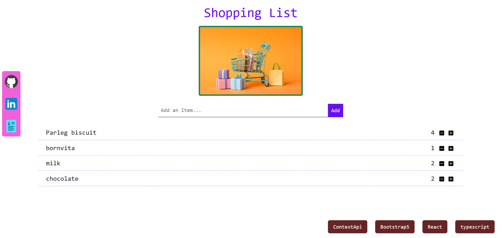

## Movie Search Website

 
 

<h3>Tech Stack Used</h3>
 <ul>
  <li>CSS</li>
  <li>ReactJS</li>
  <li>Typescript</li>
 </ul>
 
<h3><a href="https://prachi-shopping-list.netlify.app/">Visit Now</a></h3>

Don't forget to ⭐ if you like it

<h3>Thank You !</h3>
 

    

<!-- to run : npm run dev -->
<!-- npm install react-hook-form -->
